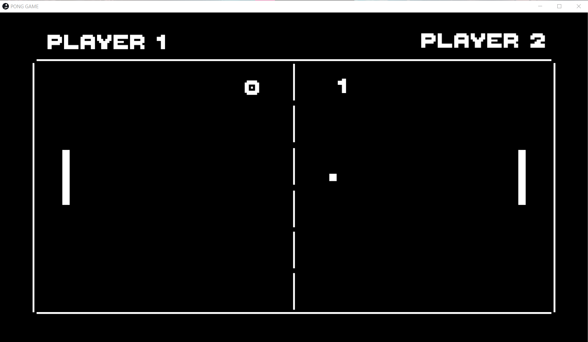

# PONG GAME

 A classical simulation game of table tennis in 2-D made with Unity.  
 
 

## DESCRIPTION
 Pong is a two-dimensional sports game that simulates table tennis.
 The player controls an in-game paddle by moving it vertically across the left or right side of the screen.
 They can compete against another player controlling a second paddle on the opposing side.
 Players use the paddles to hit a ball back and forth. 
 The goal is for each player to reach eleven points before the opponent, points are earned when one fails to return the ball to the other.

## INSTALLATION
 Install the PONGGAME Setup(x86).exe file.

## MODES: 2-Players and Vs Computer
```console 
 In 2-player mode play with your friends.
 Play against the Computer in Vs mode. 
```

## HOW-TO-PLAY
|keys|description|
|---|---|
|Player-1|
|<kbd>W</kbd>/<kbd>S</kbd>|move Racket UP/DOWN|
|Player-2|
|<kbd>↓</kbd>/<kbd>↑</kbd>|move Racket UP/DOWN|

